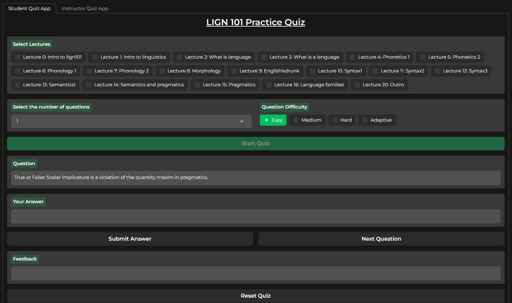
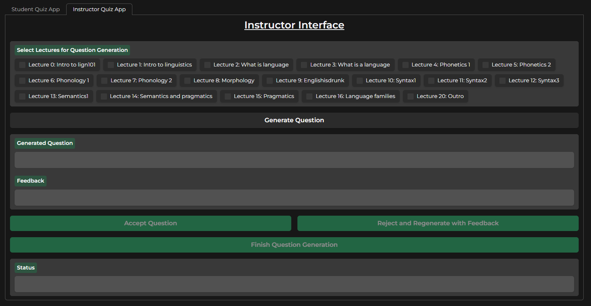

Group Members:
Seshagiri Rao Mallina (Seshu) A16659161,
Jung Liew Tzen A16390733,
Hunter Cheng,
Sahil Patel A16499476

# Introduction

Hi everyone, this is our final project for LIGN 167. Our project was aimed to be a tool that can be used to quiz students on what lecture(s) they want to be quizzed on. Students are able to select which lecture(s) they are particularly struggling with and can ask our project to generate questions to help test their knowledge. The students have the option of running the quiz with 1,5,10,15,20 questions for the selected lecture(s) content. At the end of the quiz they will recieve a score which is the percentage of questions they answered correctly. They also have the option to keep doing quizzes by pressing the reset quiz button. Furthermore, we implemented a dashboard so they can see which lectures they did and their overall academic trend in the class. This quiz tool is used on LIGN 101 material only. Furthermore, we developed a instructor interface where they can generate and tailor questions to use for their exams, quizzes, or assignments.  

# Before Getting Started
When cloning our repo do the following:

Make sure your current environment has Python and has these packages installed:
os, random, glob, sys, re (should come with Python)

gradio, openai, pandas (need to install if haven't)
```
pip install gradio
pip install openai
pip install pandas
```

If the code is having trouble accessing and parsing transcript files, uncomment line 102 and replace 'PLACEHOLDER' with your global file path to the 'podcast_transcripts' folder.
```
# folder_path = PLACEHOLDER ## Uncomment line and replace placeholder with path
```


# Using Student Interface

The code for our final project for the  interface is in quizApp.py.

When you run this file you will get something like this that will pop up in the terminal:

> Running on local URL:  http://127.0.0.1:7865

You want to copy paste **http://127.0.0.1:7865** into any web browser ie safari, chrome, etc. You should ignore the other link that is provided ie the one that says public URL. Once you get the link you should be greeted to a page that looks similar to this:



Once you get to the start page of the quiz. First select which lecture(s) you want to test your knowledge on. The lectures are to the top left of the screen. After that select which lectures you want, then select from the drop down menu the number of questions you want on your quiz. The drop down menu is to the right of the lecture selection. Then select which difficulty you would like. The adaptive difficulty starts off at Medium, and gets easier or harder based on your score. Then press start quiz. You should then be given the first question of your quiz.

> Important Note: you have to select at least one lecture in order for the quiz to work. It will not start a quiz until all features are chosen.

## Answer Formats:

### **MCQ:**
You can submit answers in any of these formats (not case sensitive) these also go for options B,C,D too:
<ul>
  <li>A.</li>
  <li>A)</li>
  <li>A.)</li>
  <li>A</li>
</ul>

### **T/F**
For True/False questions these answers are viable (not case sensitive):
<ul>
  <li>True or False</li>
  <li>T or F</li>
</ul>

### **Fill in the Blanks**
For fill in the blanks the exact phrase/word with correct spelling is required. If there are more than one blank, answers should be separated by a ";". Such as:
<ul>
  <li>answer1 ; answer2</li>
</ul>

After you type in which answer you think is correct, click **Submit Answer** button. This should then tell you if you got the right answer, if you got the wrong answer it will show you the correct answer along with the explanation of the correct answer. After you understand why your answer is incorrect click the **Next Question** button to advance to the next question.

After the end of the quiz you will be shown your score ie the percentage of questions that you answered correctly. If you want to take another quiz press the **Reset Quiz** button then the **Start Quiz** button. This will restart your quiz, however it will not reset the lectures that have been picked and the number of questions that you have selected (Change them before you click start quiz again if you desire). You can also now see your performance visually, by pressing the **Update Performance Plots** button which will visualize your performance in 4 different ways. You can switch between them with the tabs titled what each plot is showing.

# Using Instructor Interface

When you switch to the instructor tab, you will be greeted to a screen like this:



Select which lectures that you will like your quiz to be on. Then click **Generate Question** button. A question should be displayed ie you will get either an MCQ, T/F, or Fill in the blanks question along with possible answer choices and the correct answer. If you like the question that was shown then press **Accept Question** button, this will store the question that you genereated. If you did not like the question you can provide feedback on why you think the question is bad, ie its too subjective, not difficult enough, etc. Then after you type in your feedback click the **Reject and Regenerate with Feedback** button. This should give you a better question tailored to the feedback that was given. If you like this version you can click **Accept Question** button to keep it or give feedback to get a better question. Once you feel like you have generated enough questions for your assignment/exam press **Finish Question Generation** button. This will save all the questions that you have accepted and write them into a file called "accepted_questions.txt". It will not overwrite previous saved files, and will just write to a new one titled "accepted_questions{int}.txt".

# Frequently Asked Questions (FAQ)
Question: The questions seem to take a while to load?
> Don't be suprised if it takes the application 20-30 seconds to create your question. If it takes longer then restart the application there seems to be something wrong with the API call.

Question: What happens when you get the message: Failed to generate correctly formatted question?
> There seems to be something wrong with the output of the API. Click next question. If another question is not shown, then restart the application. Updated the code such that you won't miss a point if the API call did not generate a question.

Question: What happens when there is a blank screen, no question visible:
> This is okay. This means the API did not return a question. Just click the next question button. You will not be penalized for this.

Question: How many attempts do we have per question?
> Each question you get one chance

# Further Improvements
1. Implement a timer (students would get 2 minutes to answer the questions)
2. Implement suggestions (based on the trend of the student it would suggest number of questions, which lecture(s) the student should focus on, etc)
3. Implement a scoring function that takes into account the difficulty of the problem (if student is answering difficult questions right they will recieve more points than if they answered an easy question correctly)
4. Implement a new program that takes the questions that the professor made for an assignment/exam and randomly order the questions for students to take in a lockdown browser
